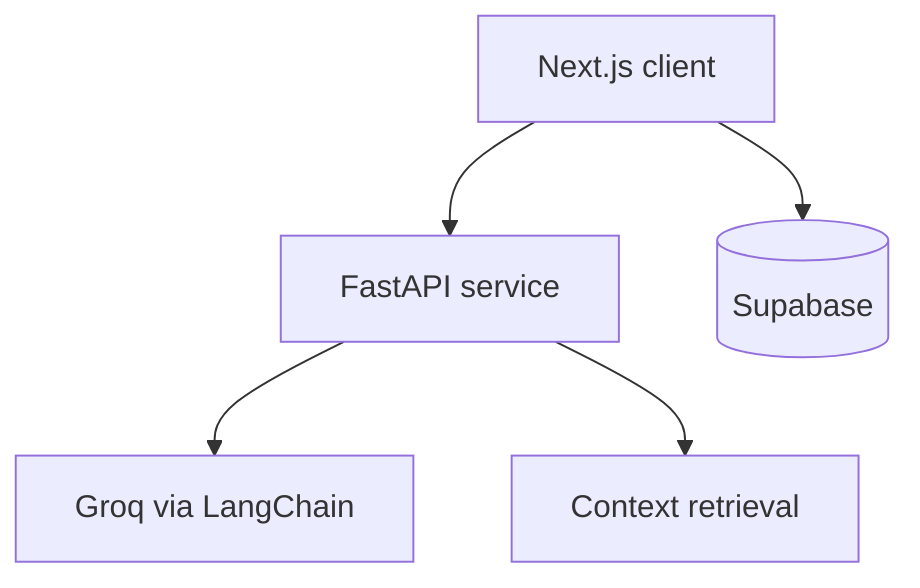

# OS-MHKC — Mental Health Knowledge Companion

An experimental full-stack mental-health knowledge companion with multi-persona AI conversations, role-oriented dashboards, and a Supabase-ready data layer.


## Project focus

- Multi-persona chat modes for empathetic, CBT-inspired, and culturally aware responses
- Next.js interface with patient, doctor, and administrator dashboard experiences
- FastAPI service with typed chat requests, health checks, and CORS configuration
- Optional Groq-powered generation with a local fallback when no API key is present
- Supabase schema and seed data for extending the prototype beyond mock context

## Architecture



| Layer | Technology | Port |
| --- | --- | ---: |
| Frontend | Next.js 16, React 19, Tailwind CSS 4, Framer Motion | `3000` |
| Backend | FastAPI, LangChain, Groq | `8000` |
| Data | Supabase Postgres with schema and seed scripts | Cloud |

## Repository layout

```text
OS-MHKC-Monorepo/
├── frontend/    # Next.js application
├── backend/     # FastAPI service and AI personas
└── supabase/    # Database schema and seed data
```

## Run locally

### 1. Backend

```bash
cd backend
python -m venv .venv
source .venv/bin/activate  # Windows: .venv\Scripts\activate
pip install -r requirements.txt
cp .env.example .env
uvicorn main:app --reload --port 8000
```

### 2. Frontend

```bash
cd frontend
npm install
cp .env.example .env.local
npm run dev
```

Open `http://localhost:3000`. The API documentation is available at `http://localhost:8000/docs`.

### 3. Supabase

Create a Supabase project, then run `supabase/schema.sql` followed by `supabase/seed.sql` in the SQL editor.

## Environment variables

| File | Variable | Purpose |
| --- | --- | --- |
| `backend/.env` | `GROQ_API_KEY` | Enables full LLM responses |
| `backend/.env` | `SUPABASE_URL` | Supabase project URL |
| `backend/.env` | `SUPABASE_KEY` | Supabase API key |
| `frontend/.env.local` | `NEXT_PUBLIC_API_URL` | FastAPI base URL |
| `frontend/.env.local` | `NEXT_PUBLIC_SUPABASE_URL` | Public Supabase URL |
| `frontend/.env.local` | `NEXT_PUBLIC_SUPABASE_ANON_KEY` | Public anonymous key |

Never commit real keys. The included example files contain placeholders only.

## API

| Method | Endpoint | Purpose |
| --- | --- | --- |
| `GET` | `/health` | Service health check |
| `POST` | `/api/v1/chat` | Generate a persona-aware response |

## Responsible-use notice

This repository is an educational prototype, not a medical device or a substitute for diagnosis, therapy, crisis services, or professional care. AI-generated output can be incomplete or wrong. Anyone in immediate danger should contact local emergency or crisis services.

## Maintainer

Maintained by [Aman Koley](https://github.com/Aman10n).
